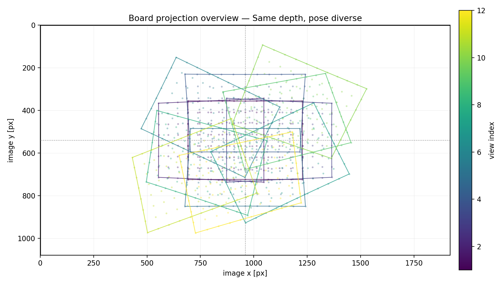
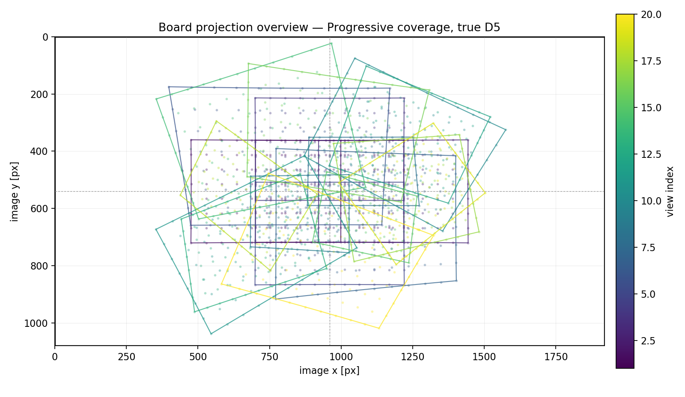
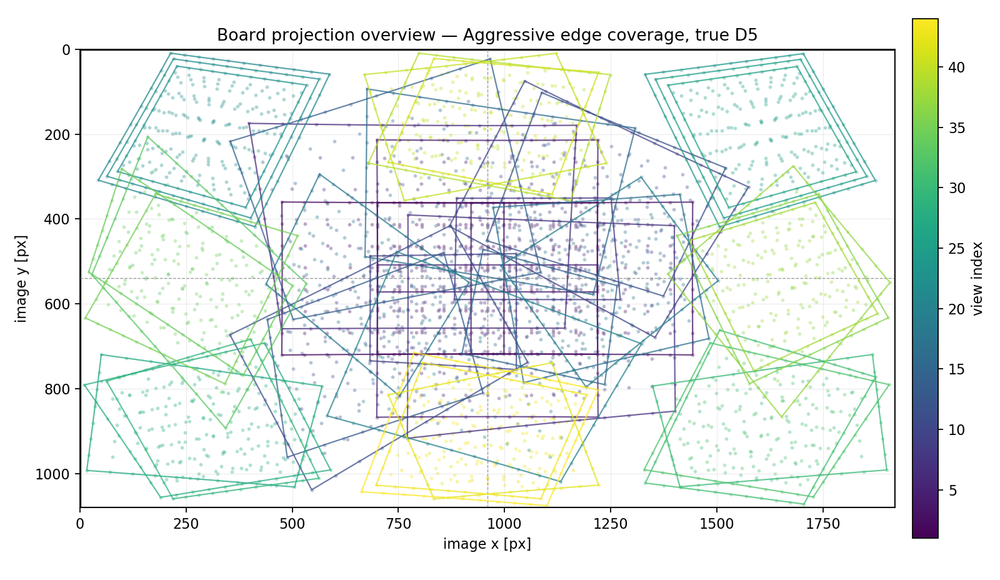
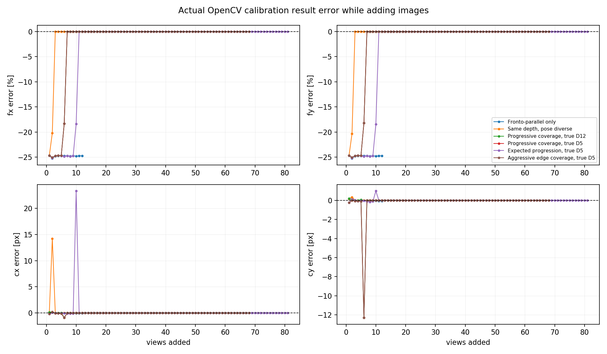
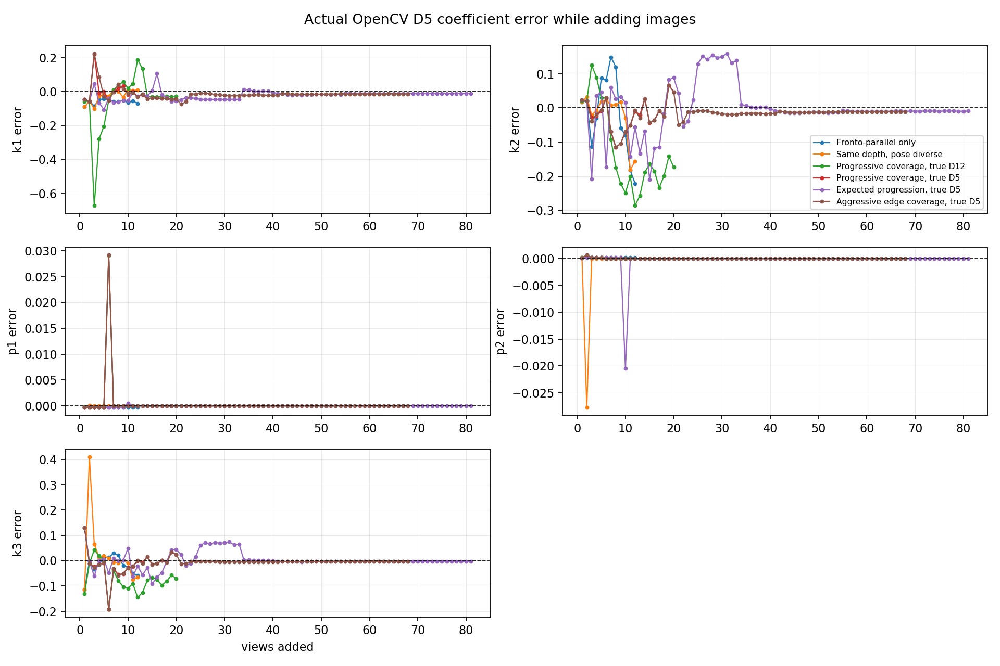
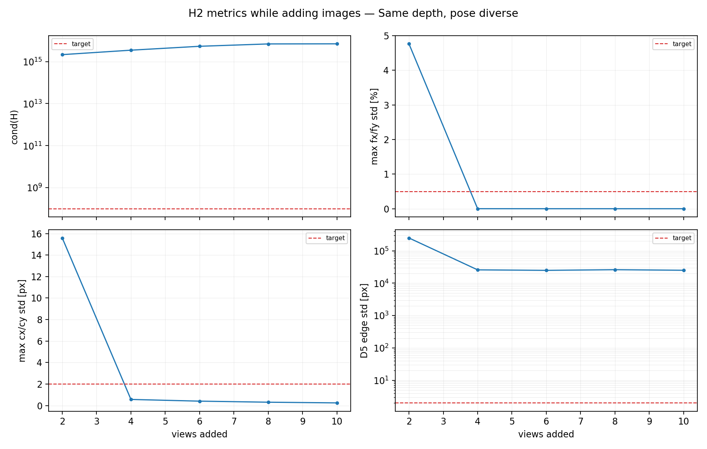
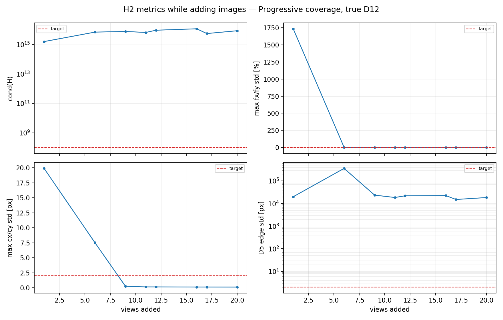
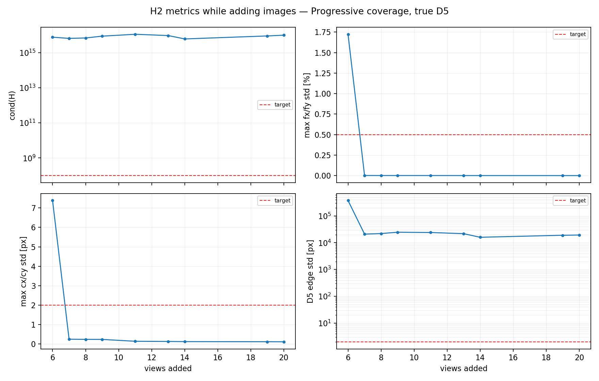
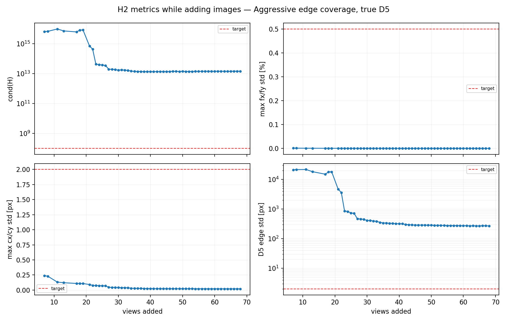

# H2 数值可观测性实验记录

## 结论

这版实验报告改为“实际 OpenCV 标定结果 + H2 可观测性指标 + matplotlib 图表”。核心结论：

- OpenCV `calibrateCamera` 在退化数据上也可能返回一个低 RMS 的解；仅看“求解成功 / RMS 小”不等于标定可靠。
- 正视数据集会得到稳定但错误的焦距：最终 `fx/fy` 约低估 `24.76%`。这正是人工“拍够张数”最容易漏掉的风险。
- 新增的标准递进数据集按“正视平铺满 → 多姿态 → 补深度 → 补边角”累加图片：多姿态后实际 K 已接近真值，补边角后 `D5 edge σ` 从约 `3897px` 降到 `262px`，指标趋势符合公式预期。
- 但当前正式 OpenCV D12 求解路径下，递进数据集最终仍未达 H2 goal：`cond(H)≈1.40e13`，`D5 edge σ≈262px`，距离 `1e8 / 2px` 目标仍很远。
- 因此当前 H2 实现的“不要只看 RMS，要看信息矩阵/协方差”的方向合理；同时实验暴露出一个工程风险：当前 OpenCV 求解始终启用 `CALIB_RATIONAL_MODEL | CALIB_THIN_PRISM_MODEL`，D12 高阶项会让 H2 条件数/协方差长期病态。后续真机若复现，应考虑分阶段释放 D12 或先 D5 后 D12，而不是只调阈值。

## 复跑命令

```bash
cd /home/sosilent/Camera_Toolbox

export LD_LIBRARY_PATH=\
.deps/ffmpeg/linux-aarch64-ubuntu20/8.1.2-r1/ffmpeg/runtime:\
.deps/opencv5/linux-aarch64-ubuntu20/opencv/lib

PONGBOT_OBSERVABILITY_SIM_DIR=/tmp/h2_observability_sim \
cargo test -p pongbot-calib-tool --test observability_simulation -- --ignored --nocapture

python3 .ai_doc/experiments/generate_h2_observability_plots.py \
  --input-dir /tmp/h2_observability_sim \
  --output-dir .ai_doc/experiments/figures/h2_observability
```

实验源码：

```text
crates/frontends/imgui/tests/observability_simulation.rs
.ai_doc/experiments/generate_h2_observability_plots.py
```

输出数据：

```text
/tmp/h2_observability_sim/metrics.csv
/tmp/h2_observability_sim/corners.csv
```

报告图表：

```text
.ai_doc/experiments/figures/h2_observability/
```

## 实验设计

### 固定条件

| 项 | 值 | 说明 |
|---|---:|---|
| 图像尺寸 | 1920×1080 | 接近 X5 标定输入 |
| 棋盘 | 11×8 内角点，40mm | 与工具提示一致 |
| 真值内参 | fx=1200, fy=1180, cx=960, cy=540 | 合成相机 |
| 真值畸变 | D5 或 D12 | 按数据集切换 |
| 实际求解 | `OpenCvCalibrationBackend::calibrate` | 使用项目正式 OpenCV 标定路径 |
| H2 分析 | `analyze_solution` | 与 UI 采集完成判定同一实现 |
| 图表 | matplotlib PNG | 不手写 SVG |

### H2 当前达标标准

这些标准来自 `crates/frontends/imgui/src/observability.rs`，报告图表中的红色虚线也使用同一组阈值。

| 指标 | 当前目标 | 越界含义 | 符合预期的数据集应呈现 |
|---|---:|---|---|
| RMS | `<= 0.5px` | 角点噪声、模糊、错检或模型不匹配 | 通常先满足；但不能单独证明可用 |
| `cond(H)` | `<= 1e8` | 信息矩阵病态，参数方向强相关 | 随姿态/深度/边角补充整体下降并稳定 |
| `max fx/fy std` | `<= 0.5%` | 焦距与外参尺度/倾斜仍耦合 | 多姿态 + 深度后应快速下降 |
| `max cx/cy std` | `<= 2px` | 主点缺少偏中心/roll/四角约束 | 偏中心和 roll 后下降，边角补充后稳定 |
| `D5 edge σ` | `<= 2px` | 主畸变在图像边缘预测仍不稳定 | 只有大半径/四角覆盖后才应数量级下降 |

符合预期的完整采集曲线不要求每一步单调；OpenCV 每次会重新联合优化全部内参、畸变和每张外参，新增一张图可能改变旧图外参或触发不同局部解。但阶段趋势应满足：

```text
正视平铺满
  → RMS 可低，但 H 不满秩或焦距 σ 极大
多姿态
  → 焦距/主点误差和 std 明显下降
补深度
  → 焦距尺度更稳定，焦距 σ 继续下降
补边角
  → D5 edge σ 数量级下降，畸变提示应逐步收敛
```

### 数据集

| 数据集 | 目的 | 图表解读重点 |
|---|---|---|
| `fronto_parallel_only` | 只正视拍摄，包含平移和远近 | OpenCV 能求解但焦距错误；H2 大多不满秩或极病态 |
| `same_depth_pose_diverse` | 同深度加入 yaw/pitch/roll | K/D 可拟合真值，但缺少深度变化，H2 仍病态 |
| `progressive_full_coverage_true_D12` | 普通渐进覆盖，真值含 D12 | 暴露 D12 过参数化风险 |
| `progressive_full_coverage_true_D5` | 普通渐进覆盖，真值只含 D5 | 对比 D5 真值下，OpenCV D12 求解仍会病态 |
| `expected_progression_true_D5` | 正视平铺满 → 多姿态 → 补深度 → 补边角的标准递进流程 | 用同一条曲线观察各阶段对 RMS、K/D 误差、H2 std/cond 的作用 |
| `aggressive_edge_coverage_true_D5` | 加入大量边缘/四角样本 | H2 指标明显改善，但 D12 求解下仍未达标 |

## 公式依据

平面棋盘满足 $Z=0$，单张图的平面投影为：

$$
H = K [r_1\ r_2\ t]
$$

张正友法用旋转列正交性约束内参：

$$
h_1^T \omega h_2 = 0
$$

$$
h_1^T \omega h_1 = h_2^T \omega h_2
$$

$$
\omega = K^{-T}K^{-1}
$$

这说明单张图只能提供有限约束；多张图的姿态和覆盖越独立，内参越可观测。

H2 在当前标定解附近线性化重投影残差：

$$
e(p + \Delta p) \approx e(p) + J\Delta p
$$

最小二乘局部二阶近似：

$$
\|e + J\Delta p\|^2 \approx \Delta p^T (J^TJ)\Delta p
$$

信息矩阵：

$$
H_{info}=J^TJ
$$

当前实现把每张图拆成内参/畸变与外参两组 Jacobian：

$$
J = [J_k\ J_e]
$$

其中 $J_k$ 是内参/畸变 Jacobian，$J_e$ 是每张图外参 Jacobian。为了判断 dataset 对内参/畸变的真实约束，H2 用 Schur complement 消去每张图外参：

$$
H_{eff}=H_{kk}-H_{ke}H_{ee}^{-1}H_{ek}
$$

再对所有 view 累加：

$$
H = \sum_i H_{eff,i}
$$

线性高斯近似下：

$$
\Sigma \approx \sigma^2 H^{-1}
$$

参数标准差：

$$
std_i=\sqrt{\Sigma_{ii}}
$$

如果两个参数对残差的影响相似，对应的 $J$ 列方向接近共线，$H=J^TJ$ 会病态：

```text
参数影响相似
  → J 的列相关
  → H 的小特征值接近 0
  → cond(H) 变大
  → H⁻¹ 对角线变大
  → 参数 std 变大
```

因此 H2 判断的是“当前数据是否真正约束住参数”，不是“是否凑够了姿态类别”。

## 图像覆盖概览

这些图不是相机实拍图，而是每组实验中合成棋盘角点在 1920×1080 图像上的投影覆盖。颜色表示 view index。

### 正视拍摄


正视数据覆盖了中心、上下左右、远近和四角平移，但棋盘法向几乎不变。它能让 OpenCV 找到低 RMS 解，却不能把焦距、深度、畸变方向解耦。

### 同深度姿态多样



同深度加入 yaw/pitch/roll 后，几何形状比正视丰富，但所有图仍围绕同一深度。实际 K/D 可以被拟合到真值附近，但 H2 条件数仍很高。

### 普通渐进覆盖



普通渐进覆盖包含正视、近远、横竖倾斜、roll 和部分边缘样本。它能明显改善焦距/主点实际误差，但边缘半径仍不足以稳定 D12 求解下的畸变协方差。

### 标准递进数据集


这组数据按采集动作顺序累加：先正视平铺满画面，再加入 yaw/pitch/roll，多深度段，最后补边缘和四角。它比独立场景更接近实际采集过程，用于观察每个动作对各项指标的边际作用。

### 强边缘/四角覆盖



强边缘集把角点推到更大半径和四角区域。H2 中 `D5 edge σ` 出现数量级下降，符合“畸变必须靠大半径样本约束”的公式预期。

## 实际 OpenCV 标定结果变化

下面两张图直接来自 `OpenCvCalibrationBackend::calibrate` 的输出，不是手填真值，也不是只看 H2 拒绝原因。

### 内参误差随图片加入变化



关键现象：

- 正视数据集最终仍有约 `-24.76%` 焦距误差；RMS 很小但解是错的。
- 同深度姿态多样、普通渐进覆盖、强边缘覆盖都能把最终 K 拟合到接近真值。
- 这说明“实际求解结果”必须和“可观测性”一起看：解接近真值不代表工程上可依赖，尤其合成数据无噪声时更容易隐藏病态。

### D5 畸变系数误差随图片加入变化



关键现象：

- 退化数据也可能把某些畸变系数拟合到看似合理的位置，但这种结果依赖合成无噪声条件。
- D12 求解模型会把低阶/高阶畸变项互相补偿；仅看 D5 系数误差无法判断完整模型是否稳定。
- 因此报告保留实际 K/D 误差图，但最终判定仍需要 H2 的条件数和协方差指标。

## H2 指标随图片加入变化

### 正视拍摄


正视数据中，OpenCV 从第 1 张就能返回解，但 H2 大量阶段无法形成稳定满秩矩阵；能分析的阶段条件数也在 `1e15` 量级，`D5 edge σ` 最小仍约 `7201px`。这说明正视平移/远近不是充分激励。

### 同深度姿态多样



同深度数据实际 K/D 结果接近真值，但 H2 显示 `cond(H)` 仍在 `1e15` 量级，`D5 edge σ` 最小约 `23162px`。这说明 yaw/pitch/roll 不能完全替代深度变化和大半径覆盖。

### 普通渐进覆盖，真值 D12



普通覆盖能让实际内参误差下降到接近 0，但 D12 高阶项导致信息矩阵长期病态。`D5 edge σ` 最小仍约 `14334px`，说明 D12 全开时，协方差被高阶参数相关性放大。

### 普通渐进覆盖，真值 D5



即使真值只有 D5，项目正式 OpenCV 路径仍启用 D12 flags。实际 K/D 可拟合得很准，但 H2 仍认为畸变方向不稳定。这不是“图表失败”，而是暴露当前求解策略会把高阶自由度引入协方差判断。

### 标准递进流程，真值 D5


这条曲线用于回答“符合预期的数据集，各项指标应如何变化”：

- 正视平铺满阶段结束于第 9 张：RMS 约 `3e-5px`，但 `fx/fy` 仍错约 `-24.77%`，焦距 σ 高达 `439%`，`D5 edge σ≈15951px`。
- 多姿态阶段结束于第 21 张：实际 `fx/fy/cx/cy` 已接近真值，焦距 σ 降到 `0.00069%`，主点 σ 降到 `0.126px`；主要剩余问题转为畸变约束。
- 补深度阶段中，第 32 张达到焦距 σ `0.00039%`、主点 σ `0.080px`；阶段末端第 33 张在本次联合重求解下又退回未满秩，说明指标可能非单调。
- 补边角阶段结束于第 81 张：`D5 edge σ` 从第 34 张约 `3897px` 降到第 81 张约 `262px`，边缘覆盖确实有效；但距离 `2px` 目标仍很远。

阶段末端摘要：

| 阶段 | 阶段结束 view | RMS(px) | fx/fy 误差(%) | cx/cy 误差(px) | cond(H) | 焦距 σ(%) | 主点 σ(px) | D5 edge σ(px) | H2 提示 |
|---|---:|---:|---:|---:|---:|---:|---:|---:|---|
| 正视平铺满 | 9 | 2.98e-05 | -24.767/-24.767 | -0.091/-0.111 | 5.83e+15 | 439.087 | 2.354 | 15950.893 | 焦距仍未充分约束：请增加远近变化和横竖倾斜 |
| 多姿态 | 21 | 2.92e-05 | -2.09e-06/8.03e-07 | 0.002/0.003 | 6.20e+15 | 6.90e-04 | 0.126 | 15305.614 | 畸变仍未充分约束：请让角点覆盖画面大半径和四角 |
| 补深度 | 33 | 2.94e-05 | 4.84e-06/6.83e-06 | 5.24e-04/0.002 | -- | -- | -- | -- | 内参信息矩阵未满秩，请继续采集不同姿态 |
| 补边角 | 81 | 2.96e-05 | 2.29e-06/2.27e-06 | 4.84e-05/2.77e-04 | 1.40e+13 | 1.25e-04 | 0.019 | 262.193 | 畸变仍未充分约束：请让角点覆盖画面大半径和四角 |

注意：阶段末端如果显示 `--`，不是 OpenCV 未求解，而是 H2 在该次联合重求解的 Schur complement 后未得到满秩内参信息矩阵。图中的中间点仍能显示该阶段曾经达到过的局部最优 std/cond。

### 强边缘/四角覆盖，真值 D5



强边缘数据对 H2 有明确收益：

- 第 6 张：`D5 edge σ ≈ 346319px`
- 第 21 张：`D5 edge σ ≈ 4466px`
- 第 40 张：`D5 edge σ ≈ 315px`
- 第 68 张：`D5 edge σ ≈ 267px`

趋势正确，但仍未达到当前 `2px` 目标。原因不是“边缘无效”，而是 D12 高阶项在正式求解路径中仍与 D5 主畸变强耦合。

## 关键里程碑

| 数据集 | OpenCV 首次可解 | H2 首次可分析 | H2 首次达标 | 最小 cond(H) | 最小 D5 edge σ(px) | 最终 fx/fy 误差 | 最终 cx/cy 误差(px) |
|---|---:|---:|---:|---:|---:|---:|---:|
| Fronto-parallel only | 1 | 3 | -- | 1.22e+15 | 11328.910 | -24.756/-24.756 | -0.046/-0.068 |
| Same depth, pose diverse | 1 | 2 | -- | 2.14e+15 | 22316.783 | 1.13e-05/1.08e-05 | 0.001/0.001 |
| Progressive coverage, true D12 | 1 | 1 | -- | 1.58e+15 | 15862.421 | -1.69e-06/-3.75e-06 | -0.002/-8.28e-04 |
| Progressive coverage, true D5 | 1 | 9 | -- | 5.58e+15 | 14990.715 | -5.02e-06/-4.57e-06 | 0.002/-2.63e-04 |
| Expected progression, true D5 | 1 | 8 | -- | 1.25e+13 | 260.516 | 2.29e-06/2.27e-06 | 4.84e-05/2.77e-04 |
| Aggressive edge coverage, true D5 | 1 | 5 | -- | 1.30e+13 | 266.754 | 1.43e-06/8.10e-07 | 4.22e-04/-6.76e-05 |

解释：

- `OpenCV 首次可解 = 1` 不代表 1 张图能可靠标定；它只说明 OpenCV 可以返回一个数值解。
- `H2 首次可分析` 表示 Schur complement 后的信息矩阵能被数值处理；不代表达标。
- 当前所有实际 OpenCV 路径实验都没有 H2 达标。主要阻塞来自 D12 模型下的条件数/畸变协方差，而不是 RMS。

## 对当前实现的判断

| 判断项 | 图表证据 | 结论 |
|---|---|---|
| 只看 RMS 不安全 | 正视集 RMS 极低但 fx/fy 错约 25% | H2 必须存在 |
| 姿态多样但同深度仍不充分 | 同深度集 K/D 接近真值但 cond(H) 仍 `1e15` | bin/角度数量不能替代数值可观测性 |
| 边缘覆盖确实有效 | 强边缘集 D5 edge σ 从 `346319px` 降到 `267px` | H2 提示方向正确 |
| D12 会放大病态 | 真值 D5 下正式 D12 求解仍长期不达标 | 需要区分主畸变目标和高阶诊断 |
| 当前阈值不能只凭合成实验定死 | 强边缘无噪声合成仍未达 `2px` | 后续要用真机数据校准 D12 策略 |

## 需要注意的工程边界

1. 本实验现在使用实际 OpenCV 标定路径，但输入仍是合成角点；真实相机还有模糊、曝光、滚快门、检测噪声、板面不平整。
2. 当前 backend 固定启用 D12 flags；所以“真值 D5”实验仍会按 D12 模型求解。这与正式工具一致，但会让高阶自由度参与 H2 条件数。
3. 如果真机数据也长期出现“实际 K/D 稳定但 H2 不达标”，优先检查求解模型策略：
   - 先 D5 求解并评估采集充分性；
   - D5 稳定后再释放 D12；
   - 或在 H2 中区分 D5 主模型信息矩阵和 D12 诊断矩阵。
4. 不建议简单放宽 `D5 edge σ <= 2px` 或 `cond(H) <= 1e8`。阈值应基于真机重复采集一致性、EEPROM 写入后 reprojection/rectification 效果、边缘误差来校准。

## 结论落点

这份图表化实验支持当前 H2 方向，但也把风险暴露得更明确：

```text
OpenCV 能返回低 RMS 解
  ≠ 参数已解耦
  ≠ D12 模型稳定
  ≠ 可以安全结束采集
```

H2 的价值是把这些隐藏风险显式化。下一步真机验证应重点记录每张加入后的 `metrics.csv` 同列数据，比较实际重复标定的一致性，而不是只看单次 RMS。
