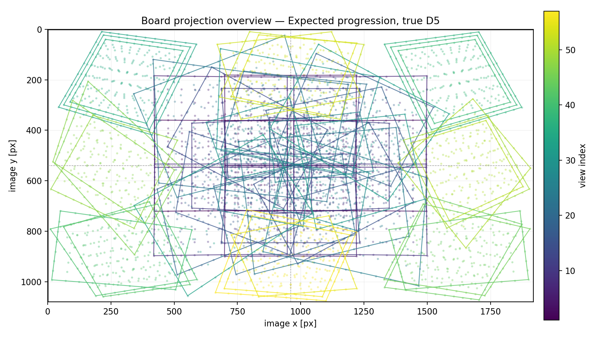
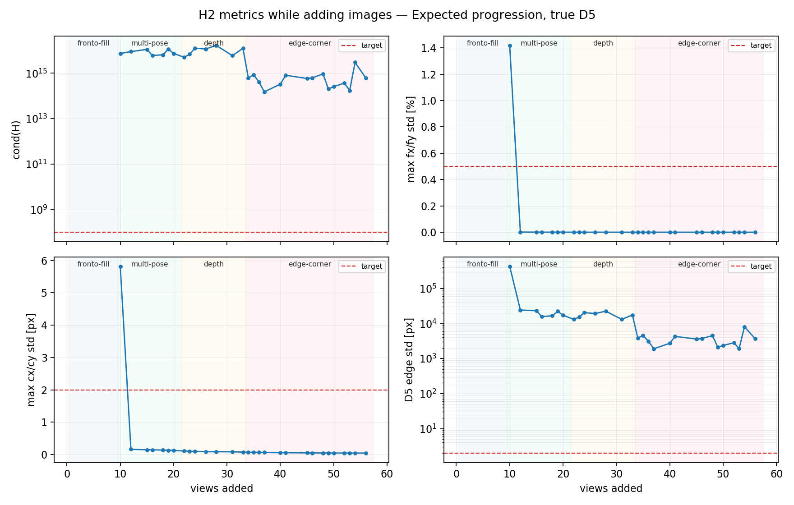
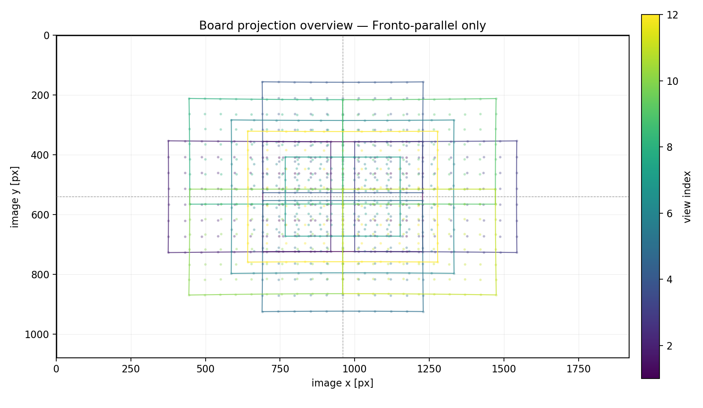
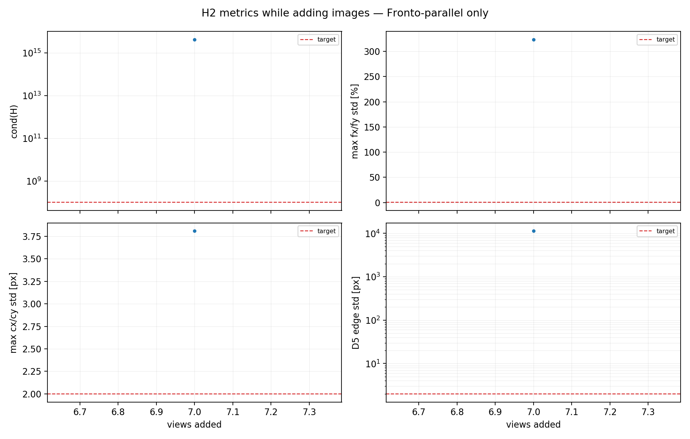

# H2 数值可观测性实验报告

## 1. H2 改造意图

旧版采集完成条件依赖人工规则：拍够若干张、覆盖若干 tilt/bin、边缘/中心大致覆盖。问题是这些规则只描述“动作是否做过”，不直接回答标定真正关心的问题：

```text
当前角点观测
  → 是否把 fx/fy、cx/cy、畸变参数真正约束住
  → 参数之间是否仍可互相补偿
  → OpenCV 返回的低 RMS 解是否稳定可信
```

H2 的目标是把完成条件从经验动作改成数值可观测性：

- 不再把 tilt/bin 数量作为最终 goal。
- 仍允许 UI 显示采集提示，但完成判定以 `ObservabilityReport::goal_met()` 为准。
- 每次数据集变化后，使用项目正式 `OpenCvCalibrationBackend::calibrate` 先求解，再对实际解做 H2 分析。
- H2 不判断“这张图看起来丰富”，而判断“在当前解附近，所有待估参数是否有足够独立约束”。

这也是本实验的核心：构造不同图像角点分布，看真实 OpenCV 求解结果和 H2 指标如何变化。

## 2. 当前实现现状

实验链路已经切到正式求解路径，而不是直接喂真值解：

合成角点不是理想无畸变投影。`synthetic_detections()` 会先取 `true_distortion_coefficients()`，`project_board()` 内部按 D5/D12 模型调用 `distort()`，再通过真值 $K$ 投到像素坐标。当前补边角数据还增加了完整棋盘画幅内断言，避免用越界角点模拟真实不可检测画面。

```text
SyntheticPose 序列
   │
   ├─ project_board                     (生成棋盘角点像素坐标)
   │
   ├─ OpenCvCalibrationBackend::calibrate
   │    └─ OpenCV calibrateCamera        (实际估计 K、D、每张图外参)
   │
   ├─ analyze_solution
   │    ├─ 数值 Jacobian
   │    ├─ Schur complement 消去每张图外参
   │    ├─ 估计信息矩阵 H、协方差、stddev、cond(H)
   │    └─ 输出 ObservabilityReport
   │
   ├─ metrics.csv / corners.csv
   │
   └─ matplotlib PNG + Markdown 报告
```

相关文件：

```text
crates/frontends/imgui/tests/observability_simulation.rs
.ai_doc/experiments/generate_h2_observability_plots.py
.ai_doc/experiments/figures/h2_observability/
```

复跑命令：

```bash
cd /home/sosilent/Camera_Toolbox

export LD_LIBRARY_PATH=\
.deps/ffmpeg/linux-aarch64-ubuntu20/8.1.2-r1/ffmpeg/runtime:\
.deps/opencv5/linux-aarch64-ubuntu20/opencv/lib

PONGBOT_OBSERVABILITY_SIM_DIR=/tmp/h2_observability_sim \
cargo test -p pongbot-calib-tool --test observability_simulation -- --ignored --nocapture

python3 .ai_doc/experiments/generate_h2_observability_plots.py \
  --input-dir /tmp/h2_observability_sim \
  --output-dir .ai_doc/experiments/figures/h2_observability
```

## 3. 标定法实际在求什么

棋盘是平面，棋盘坐标满足 $Z=0$。单张图中，棋盘平面到图像的几何可以压缩成单应矩阵：

$$
H = K [r_1\ r_2\ t]
$$

其中：

- $K$：相机内参，包含 $f_x,f_y,c_x,c_y$。
- $r_1,r_2$：棋盘平面两个方向在相机坐标系下的旋转列。
- $t$：该张图棋盘相对相机的平移。

张正友法利用旋转列正交性给内参约束：

$$
h_1^T \omega h_2 = 0
$$

$$
h_1^T \omega h_1 = h_2^T \omega h_2
$$

$$
\omega = K^{-T}K^{-1}
$$

单张图只能给有限约束；多张图需要让 $r_1,r_2,t$ 的组合足够独立，才能把 $K$ 从每张图外参中分离出来。

OpenCV 最终不是只用线性单应求解，而是做非线性重投影优化。对每个角点：

$$
X_c = R_i X_b + t_i
$$

$$
x = X_c / Z_c,
\quad y = Y_c / Z_c
$$

D5 畸变模型可写成：

$$
r^2=x^2+y^2
$$

$$
x_d=x(1+k_1r^2+k_2r^4+k_3r^6)+2p_1xy+p_2(r^2+2x^2)
$$

$$
y_d=y(1+k_1r^2+k_2r^4+k_3r^6)+p_1(r^2+2y^2)+2p_2xy
$$

最后投影到像素：

$$
u=f_xx_d+c_x,
\quad v=f_yy_d+c_y
$$

标定求解就是最小化所有角点重投影残差：

$$
\min_{K,D,\{R_i,t_i\}}
\sum_i\sum_j
\|p_{ij}^{obs}-\pi(K,D,R_i,t_i,X_j)\|^2
$$

所以每个角点都不是“只贡献一个位置”：它同时约束当前图外参、焦距、主点、畸变。问题在于这些参数可能用相似方式改变投影，导致互相补偿。

## 4. H2 如何判断参数是否耦合

在当前 OpenCV 解附近线性化重投影残差：

$$
e(p+\Delta p) \approx e(p)+J\Delta p
$$

最小二乘局部二阶项由信息矩阵控制：

$$
H_{info}=J^TJ
$$

如果 $J$ 的两列方向相似，说明两个参数对角点残差的影响相似；优化就可以用一个参数补偿另一个参数。此时 $H$ 会出现很小特征值：

```text
参数影响相似
  → J 的列相关
  → H 的小特征值接近 0
  → cond(H) 变大
  → H⁻¹ 对角线变大
  → 参数 stddev 变大
```

每张棋盘图都有自己的外参。外参是必要的，但不是采集 goal 关心的最终参数。H2 把 Jacobian 分成两组：

$$
J=[J_k\ J_e]
$$

- $J_k$：内参/畸变参数。
- $J_e$：每张图外参。

然后用 Schur complement 消去外参影响：

$$
H_{eff}=H_{kk}-H_{ke}H_{ee}^{-1}H_{ek}
$$

对所有 view 累加后得到只面向内参/畸变的有效信息矩阵：

$$
H=\sum_iH_{eff,i}
$$

线性高斯近似下：

$$
\Sigma \approx \sigma^2H^{-1}
$$

$$
std_i=\sqrt{\Sigma_{ii}}
$$

因此 H2 输出的 `stddev` 可以理解为：在当前角点噪声水平下，这个参数还可能漂多少。`cond(H)` 则描述整体是否病态。

## 5. 当前 H2 达标标准

这些阈值来自 `crates/frontends/imgui/src/observability.rs`，报告图里的红色虚线也使用同一组目标。

| 指标 | 当前目标 | 失败时说明 |
|---|---:|---|
| RMS | `<= 0.5px` | 角点噪声、模糊、错检或模型不匹配偏大 |
| `cond(H)` | `<= 1e8` | 参数方向仍强相关，整体信息矩阵病态 |
| `max fx/fy std` | `<= 0.5%` | 焦距与深度、倾斜、畸变仍耦合 |
| `max cx/cy std` | `<= 2px` | 主点缺少偏中心、roll、四角约束 |
| `D5 edge σ` | `<= 2px` | 主畸变在图像边缘预测仍不稳定 |

注意：这些是当前工程阈值，不是理论常数。它们需要后续用真机重复采集一致性校准。但有一点已经明确：RMS 只是残差拟合质量，不是可观测性质量。

## 6. 标准递进数据集：用一条采集流程解释解耦

这组数据最接近实际采集流程。它不是把场景平铺成多个无关实验，而是按采集动作逐步累加：

```text
正视平铺满 → 多姿态 → 补深度 → 补边角
```

图像覆盖概览：



H2 指标变化：



阶段末端摘要：

| 阶段 | view | RMS(px) | fx/fy 误差(%) | cx/cy 误差(px) | cond(H) | 焦距 σ(%) | 主点 σ(px) | D5 edge σ(px) | H2 提示 |
|---|---:|---:|---:|---:|---:|---:|---:|---:|---|
| 正视平铺满 | 9 | 2.98e-05 | -24.767/-24.767 | -0.091/-0.111 | -- | -- | -- | -- | 信息矩阵未满秩 |
| 多姿态 | 21 | 2.92e-05 | -2.10e-06/8.00e-07 | 0.002/0.003 | -- | -- | -- | -- | 信息矩阵未满秩 |
| 补深度 | 33 | 2.93e-05 | 4.79e-06/6.90e-06 | 6.50e-04/0.002 | 1.24e+16 | 3.82e-04 | 0.075 | 17523.191 | 畸变仍未充分约束 |
| 补边角 | 57 | 2.92e-05 | 1.26e-06/2.50e-06 | -2.96e-04/7.10e-05 | -- | -- | -- | -- | 信息矩阵未满秩 |

阶段末端的 `--` 表示 H2 在该次联合重求解后没有得到满秩内参信息矩阵；不是 OpenCV 没有求解。因为 OpenCV 每次都会重新联合优化全部 $K,D,R_i,t_i$，指标不要求逐帧严格单调，应看阶段趋势和数量级变化。

## 7. 各参数如何被角点分布解耦

### 7.1 正视平铺满：RMS 很低，但焦距仍错

正视平铺满把棋盘移动到中心、上下左右和四角，但棋盘法向几乎不变。角点覆盖看起来丰富，OpenCV 也能给出极低 RMS：





实际结果暴露了问题：正视数据最终 `fx/fy` 约低估 `24.76%`，但 RMS 仍在 `3e-5px` 量级。

公式解释：正视平面下，物体成像尺度近似由 $f/z$ 决定。若棋盘姿态不变，优化可以同时改变焦距 $f$ 和每张图深度 $z$，让角点仍然贴合观测：

$$
\text{image scale} \approx f \cdot \frac{\text{board size}}{z}
$$

所以正视平移主要改变 $t_x,t_y,t_z$，没有充分改变 $r_1,r_2$ 的方向。$J_f$ 与 $J_z$ 的效果相似，焦距与外参深度耦合，$H$ 病态。H2 给出焦距 σ 极大，正是这个现象。

结论：正视铺满可以改善覆盖外观，但不能作为标定完成依据。

### 7.2 多姿态：焦距和主点开始解耦

多姿态阶段加入 yaw、pitch、roll 和组合倾斜。同一块棋盘的角点在图像中不再只是整体平移/缩放，而产生透视形变。

阶段结果：

- `fx/fy` 误差从约 `-24.77%` 变到接近 0。
- 该阶段末端本次联合重求解未满秩；阶段内部可分析点仍显示焦距/主点约束显著改善。
- 这说明姿态方向有效，但 D12 全参数空间仍可能让整体信息矩阵在某些重求解点退化。

公式解释：张正友法约束来自 $r_1,r_2$ 的正交性：

$$
h_1^T\omega h_2=0,
\quad
h_1^T\omega h_1=h_2^T\omega h_2
$$

多姿态让不同图的 $r_1,r_2$ 朝向变化，等价于给 $\omega$ 的不同方向投影增加独立方程。此时焦距变化、板面倾斜变化、主点偏移造成的角点运动不再相同，Jacobian 列相关性降低。

roll 对主点也重要。只做 yaw/pitch 时，主点偏移仍可能和棋盘平移互相补偿；roll 会改变角点云相对图像坐标轴的方向，使 $c_x,c_y$ 的残差模式更难被单纯 $t_x,t_y$ 吸收。

结论：多姿态是解耦 $f_x,f_y,c_x,c_y$ 的主力。

### 7.3 补深度：稳定焦距尺度，但不直接解决畸变边缘

阶段表现：第 33 张时焦距 σ 约 `0.00038%`，主点 σ 约 `0.075px`。焦距/主点已经稳定，但 D5 edge σ 仍约 `17523px`。

公式解释：焦距和深度的朴素耦合来自：

$$
\Delta u_f \sim x_d\Delta f_x,
\quad
\Delta u_z \sim -f_x\frac{X}{Z^2}\Delta z
$$

如果所有图都在相似 $Z$，这两类变化容易互相补偿。加入近/远后，同样的 $\Delta f_x$ 和 $\Delta z$ 在不同尺度图上的残差模式不同，$J_f$ 和 $J_z$ 更容易分开。

但深度不是畸变的充分条件。若远近变化没有把角点推到大半径区域，畸变项仍缺乏强激励。

结论：补深度主要帮焦距尺度和外参分离；畸变还要看边缘/四角覆盖。

### 7.4 补边角：畸变开始被强约束

边角阶段把棋盘推向图像大半径区域和四角。本轮额外补入 24 组完整棋盘仍在画幅内的边角/边缘姿态，并用断言保证所有合成角点均在 `1920x1080` 内。H2 指标在阶段内部明显改善，但最终联合重求解仍出现信息矩阵未满秩：

- 第 33 张：`D5 edge σ ≈ 17523px`
- 第 34 张：`D5 edge σ ≈ 3850px`
- 第 37 张：`D5 edge σ ≈ 1895px`，为当前合法完整棋盘数据的最小值

公式解释：径向畸变对归一化点的影响含 $r^2,r^4,r^6$：

$$
\frac{\partial x_d}{\partial k_1}=xr^2,
\quad
\frac{\partial x_d}{\partial k_2}=xr^4,
\quad
\frac{\partial x_d}{\partial k_3}=xr^6
$$

中心区域 $r$ 小，$r^4,r^6$ 更小，高阶畸变几乎没有可观测信号。只有角点进入大半径区域，畸变参数的 Jacobian 列才有足够幅值，边缘预测方差才会下降。

主点也受益于边角。因为 $c_x,c_y$ 是像素平移项，如果角点只在中心局部区域，主点变化可能被外参平移吸收；四角覆盖扩大了观测孔径，降低这种补偿空间。

结论：畸变最苛刻，必须靠边缘/四角角点；“姿态多”不能替代“大半径覆盖”。

## 8. D12 过参数化是当前实验暴露出的主要风险

本实验有一个关键现象：即使真值只使用 D5，项目正式 OpenCV 路径仍启用 D12 flags：

```text
CALIB_RATIONAL_MODEL | CALIB_THIN_PRISM_MODEL
```

这让高阶径向项和薄棱镜项参与求解。它们在数据不足或边缘覆盖不足时，很容易与 D5 主畸变项互相补偿。结果是：

- OpenCV RMS 很低。
- `fx/fy/cx/cy` 和 D5 低阶系数看起来接近真值。
- 但完整参数空间的 $H$ 仍病态，`cond(H)` 在 `1e13~1e14` 量级，`D5 edge σ` 仍远高于 `2px`。

标准递进数据集合法补边角后的最佳可分析点：

```text
min cond(H)      ≈ 1.52e14
min D5 edge σ    ≈ 1895px
目标              1e8 / 2px
```

最终第 57 张完整棋盘数据仍可被 OpenCV 求解，且内参误差接近 0；但 H2 对该次联合解返回“内参信息矩阵未满秩”。这说明问题不是合成时没有畸变，也不是边角数量少一点的问题，而是当前 D12 全开后参数空间仍无法被这些完整棋盘观测充分约束。

所以现在不能把“不达标”简单理解成“还要继续拍更多图”。更准确的解释是：当前采集动作方向有效，但 D12 全开使参数空间过宽，H2 正在暴露过参数化风险。

工程建议：

```text
采集充分性判断：先评估 D5 主模型
  → D5 稳定后再释放 D12
  → D12 只作为高阶诊断或最终 refinement
```

这比单纯放宽 H2 阈值更安全。

## 9. 对照数据集：只保留结论级证据

完整曲线见图表；这里不再平铺每一行数据，只保留用于判断的里程碑。

| 数据集 | OpenCV 首次可解 | H2 首次可分析 | H2 首次达标 | 最小 cond(H) | 最小 D5 edge σ(px) | 最终 fx/fy 误差 | 最终 cx/cy 误差(px) |
|---|---:|---:|---:|---:|---:|---:|---:|
| Fronto-parallel only | 1 | 7 | -- | 4.17e+15 | 11331.635 | -24.756/-24.756 | -0.046/-0.068 |
| Same depth, pose diverse | 1 | 2 | -- | 2.14e+15 | 22178.934 | 1.13e-05/1.08e-05 | 0.001/0.001 |
| Progressive coverage, true D12 | 1 | 1 | -- | 1.58e+15 | 13459.671 | -1.69e-06/-3.75e-06 | -0.002/-8.28e-04 |
| Progressive coverage, true D5 | 1 | 7 | -- | 5.27e+15 | 15226.708 | -5.02e-06/-4.57e-06 | 0.002/-2.63e-04 |
| Expected progression, true D5 | 1 | 10 | -- | 1.52e+14 | 1894.569 | 1.26e-06/2.50e-06 | -2.96e-04/7.10e-05 |
| Aggressive edge coverage, true D5 | 1 | 8 | -- | 7.38e+13 | 1550.105 | -5.09e-06/-4.91e-06 | 8.97e-04/-0.001 |

对照结论：

- 正视数据证明“低 RMS 不可靠”：最终焦距错约 `25%`。
- 同深度多姿态证明“姿态能解 K，但不保证畸变稳定”。
- 普通覆盖 D5/D12 证明“真实求解链路比真值喂 H2 更病态”。
- 标准递进和强边角数据证明“边缘/四角方向有效”，但合法完整棋盘补边角后仍不能让当前 D12 全参数模型达标。

## 10. 最终判断

H2 改造的价值不是替代 OpenCV 标定，而是在 OpenCV 给出解之后判断这个解是否可依赖。

```text
OpenCV calibrateCamera
  → 给出一个能最小化当前残差的 K/D/外参

H2 observability
  → 判断当前角点集合是否真正约束住 K/D
  → 判断参数是否还在互相补偿
  → 判断继续采集应该补姿态、补深度，还是补边角
```

本次标准递进实验说明：

- 正视铺满不是安全数据集。
- 多姿态是焦距/主点解耦的关键。
- 深度变化主要帮助焦距尺度稳定。
- 边缘/四角是畸变解耦的关键，但真实可拍的完整棋盘边角覆盖仍有限。
- 当前 D12 全开会让 H2 长期病态，后续应重点验证 D5-first / staged-D12 策略，而不是继续无上限堆边角图。

下一步真机实验应直接导出同结构 CSV，把真实角点噪声、曝光、模糊、板面误差引入比较；不要只看单次 RMS 或单次 EEPROM 写入结果。
